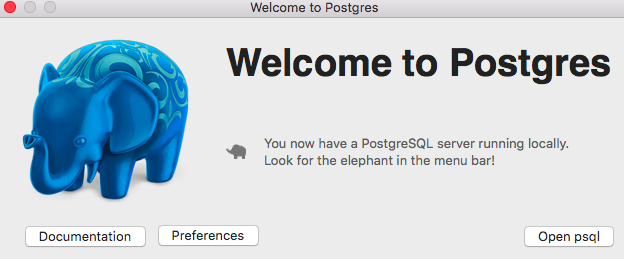
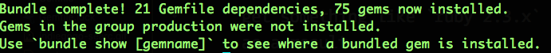
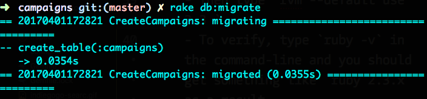
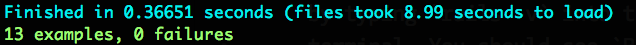
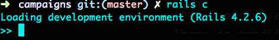

## Indiegogo Campaign Search
#### _Search through unique Indiegogo campaigns_


## Don't feel like setting this up locally on your machine?
#### No worries, click [here](https://obscure-waters-39090.herokuapp.com/) to search through Indiegogo Campaigns
## To set this project up locally:

- Before we begin, this project uses `git`, `Ruby 2.3`, `Rails 4`, and `Postgres`.
Make sure you have these configured on your machine. Follow the directions below if you do _not_ have Ruby or Rails set up. Otherwise, feel free to jump down to the _"After initial set-up is done..."_ section ✨
- **Credit:** _Part of the following set-up directions are an abridged version from [Railsbridge's Installfest](http://installfest.railsbridge.org/installfest/macintosh)._

Let's begin!
Assuming you're on MacOSX and have an OS later than Snow Leopard:
- Open your terminal
- Install a complier (like XCode) [here](http://installfest.railsbridge.org/installfest/install_xcode). (If you already have downloaded XCode, skip this step.)
- Configure Git
  - This `readme.md` assumes you already have Git configured on your machine.
  If you do **not** have `git` set-up on your machine, _stop_ and follow [these directions](http://installfest.railsbridge.org/installfest/configure_git) to configure `git`.
- Install Homebrew
  - Homebrew is an open-source software package management system for MacOSX. (If you already have Homebrew on your system, skip this step.)
  - Type this in your terminal:

     ``` ruby -e "$(curl -fsSL https://raw.githubusercontent.com/Homebrew/install/master/install)" ```
- Install RVM, or Ruby Version Manager.
  - It's an easy way to install and manage Ruby versions
  - Type this in the command line:

    ``` curl -L get.rvm.io | bash -s stable ```
  - Close your terminal, and open a new terminal window.
  - If you type ` rvm -v`, you should hopefully get something like: `rvm 1.x.x` as a result

- Configure RVM to use Homebrew
  - Type `rvm autolibs homebrew` in the terminal. This configures RVM to use Homebrew

- Install Ruby ♦️
  - Type `rvm install 2.3` in the terminal. This takes a while...
  - Type ` rvm use 2.3 `
  - Then type `rvm --default use 2.3 `
  - To verify, type `ruby -v` in the command-line and you should get something like `ruby 2.3.x` as a result.

- Install Rails
  - This particular project uses Rails 4.2.6. Type `gem install rails 4.2.6` into the terminal.
  - Verify that Rails is installed by typing `rails -v` into the terminal. You should see `Rails 4.2.6` as a result.
- Download Postgres
  - The easiest way to get Postgres up and running is to download the Postgres app [here](https://postgresapp.com/).
  - After downloading, move to the Applications folder, and double-click.
  - Click "Initialize"
  - Configure your `$PATH` variable by typing this in the terminal:
    - `sudo mkdir -p /etc/paths.d &&
echo /Applications/Postgres.app/Contents/Versions/latest/bin | sudo tee /etc/paths.d/postgresapp`
    - Close your terminal window, and re-open a new one for the changes to take effect
    - Postgres should be running on `port 5432`
    - You should see this:
    

  - ** Remember: Assuming you downloaded `Postgres` via the  OSX app, make sure the
elephant is in your menubar. If do not see the Postgres elephant running in your menubar, then _Postgres isn't running_.**


## After initial set-up is done...
-  In the terminal, `git clone git@github.com:arbonap/campaigns.git`
- `cd` into the root folder of the Campaigns app
- `bundle install` all the gems.

- `rake db:create` to create your database in Postgres.
- `rake db:migrate` to run database migrations.

- `rake db:test:prepare`
- `rake db:seed` to seed your local database.
  - ** Note: you _must_ seed your database, if not you will not see any data in your app **
- Run `rails s` to start the server

- Go to `localhost:3000` in the browser to see the magic ✨

## To run tests:
- In the root of project folder, run `rspec spec` to run all of the `rspec` tests

  - From the root directory of the project, `cd spec/controllers` to view the controller specs
  - From the root directory of the project, `cd spec/models` to view the model specs
- Run `rake db:test:prepare` after you pull or make any changes to the app, in general.

## Rails console

- In Development: `bundle exec rails console` (or `rails c` for short, like featured in the screenshot)


## Why did I choose to complete this exercise using Ruby on Rails, and React?
- I used Rails for the backend because as a framework, it provides a standard MVC structure that keeps my app logic organized. There is tradition in how a Rails app folder hierarchy is structured, which gives developers new to a project some guidance.
  - Furthermore, there are many popular, well-maintained 3rd party gems.
  - Also, there is a large emphasis on testing and test automation in the Ruby community; this helps produce high-quality, dependable code.
  - I feel like Ruby can be a very succinct language, and has many useful methods such as `.flatten` that other languages may not include into their standard library.
  - Lastly, I used Rails because I know that Indiegogo is a Rails shop.
- I utilized React to replace my Rails views. I primarily did this because, in my experience, it feels like standard Rails views (such as `.erb` and `.haml` files) are falling out of fashion.
  - Some pros of React include:
    - reusability of components.
    - React will handle all UI updates automatically when data changes.
    - Ease of debugging. there's a reactJS chrome extension that allows you to inspect the DOM to figure out which component is rendering a particular piece of UI.


## Voilá! 🍒
